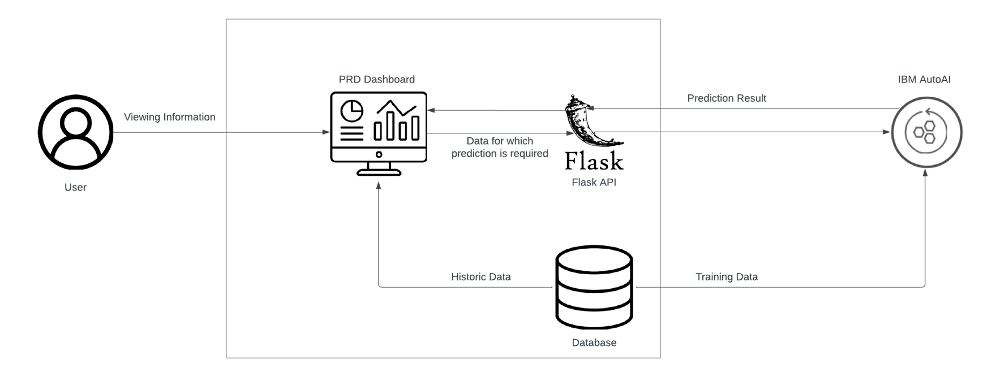

 

# Water Scarcity Prediction

- [Project summary](#project-summary)
  - [The issue we are hoping to solve](#the-issue-we-are-hoping-to-solve)
  - [How our technology solution can help](#how-our-technology-solution-can-help)
  - [Our idea](#our-idea)
- [Technology implementation](#technology-implementation)
  - [IBM AI service(s) used](#ibm-ai-services-used)
  - [Solution architecture](#solution-architecture)
- [Presentation materials](#presentation-materials)
  - [Solution demo video](#solution-demo-video)
  - [Project development roadmap](#project-development-roadmap)
- [Additional details](#additional-details)
  - [How to run the project](#how-to-run-the-project)
  - [Contributing](#contributing)
  - [Versioning](#versioning)
  - [Authors](#authors)
  - [License](#license)
  - [Acknowledgments](#acknowledgments)

## Project summary

### The issue we are hoping to solve

The Occurence of Water scarcity/drought have resulted serious impact on health, agriculture, economies, energy and the environment.We help to solve the problem by identifying very quickly, predictive insights about Water scarcity.

### How our technology solution can help

The Model can provide early warning to the authorities and communities.

### Our idea

Water scarcity poses a critical challenge worldwide, necessitating innovative solutions to address its complex dynamics. To combat this pressing issue, the development of a water scarcity prediction model emerges as a strategic imperative.

This predictive model combines multifaceted data, including historical rainfall patterns, water usage statistics, population growth trends, water resources and their live capacities, enabling the accurate forecast of potential water scarcity in specific region, providing early warnings to authorities and communities.

This proactive approach enables the implementation of timely and effective measures to manage water resources efficiently and mitigate the adverse effects of water scarcity.

The foundation of this solution rests upon comprehensive data gathering and meticulous feature engineering. By collecting extensive datasets on long-term precipitation levels, water consumption behaviors, the model gains a comprehensive understanding of the intricate interplay between these variables. Through meticulous feature engineering, key metrics such as average annual rainfall, per capita water usage, providing crucial insights into the factors influencing water scarcity trends.

In the subsequent stages, a judicious selection of the appropriate predictive modeling technique is crucial. Options range from time series analysis to the implementation of sophisticated machine learning algorithms, including Random Forest, Support Vector Machines, and Neural Networks. By evaluating the historical data and training the model with the selected approach, the system gains the ability to recognize patterns and correlations that signal an impending risk of water scarcity.

Rigorous validation procedures, incorporating metrics like Mean Absolute Error (MAE) and Root Mean Squared Error (RMSE), ensure the model's reliability and accuracy in predicting potential water scarcity scenarios. The interpretative capabilities of the model are essential in providing a comprehensive understanding of the underlying dynamics of water scarcity. Through sophisticated visualization tools, the model's predictions are translated into easily understandable insights, highlighting critical thresholds and trends that indicate an elevated risk of water scarcity. 

This interpretative framework equips decision-makers with actionable intelligence, empowering them to devise proactive strategies aimed at mitigating the impact of water scarcity.

The integration of the predictive model into an early warning system constitutes a pivotal step in the solution's implementation. By incorporating the model into an efficient and responsive early warning mechanism, authorities and communities receive timely alerts about impending water scarcity issues. This facilitates the proactive implementation of various measures, including water conservation campaigns, infrastructural enhancements, and sustainable resource management strategies, aimed at averting or minimizing the detrimental impact of water scarcity.

The solution's efficacy is contingent upon its continuous improvement and refinement. Regular updates and maintenance, coupled with the integration of the latest data, are instrumental in enhancing the model's predictive capabilities and ensuring its adaptability to evolving environmental dynamics. By actively monitoring the model's performance, stakeholders can ensure its sustained relevance and reliability in providing timely, data-driven insights into potential water scarcity challenges.

## Technology implementation

### IBM AI service(s) used

IBM Auto AI (Watson Machine learning) - [watsonx.ai](https://www.ibm.com/products/watsonx-ai)

The Auto AI graphical tool in Watson Studio analyzes your data and discovers data transformations, algorithms, and parameter settings that work best for your predictive modeling problem. Auto AI displays the results as model candidate pipelines ranked on a leaderboard for you to choose from.

### Solution architecture

Diagram and step-by-step description of the flow of our solution:

## Presentation materials

### Solution demo video

[

### Project development roadmap

- Currently this solution is limited to one region i.e. India with limited dataset. Planning to run this model globally 

- Currently we generated the model based on limited sample data. In future we will capturing more data and will work more model

- So far, the model predicts the water shortage of a country-specific region using apparent data, we will automate this process and implement it at the city  level  using real-time data from cities, as well as integrate continuous water quality monitoring  of the reservoir or water sources and establish an alarm system to notify local governments or the community of water shortages or poor water quality.

## Additional details

### How to run the project

1. Deploy the application on your local system.
2. Send your POST request to http://localhost:5000/scarcity from your UI. We have used PRD visualization application which helps us showcase the predicted value.
3. Enter all the mandatory fields and as many of the optional fields as known.

### Contributing

Please read [CONTRIBUTING.md](CONTRIBUTING.md) for details on our code of conduct, and the process for submitting pull requests to us.

### Versioning

We use [SemVer](http://semver.org/) for versioning. For the versions available, see the [tags on this repository](https://github.com/your/project/tags).

### Authors

- **Aditya Kapadne** 
- **Purvang Acharya**
- **Rohit Paranjape**
- **Shourya Nagle**
- **Tarun Kumar J**

### License

This project is licensed under the Apache 2 License - see the [LICENSE](LICENSE) file for details.

### Acknowledgments

- Based on [Billie Thompson's README template](https://gist.github.com/PurpleBooth/109311bb0361f32d87a2).
